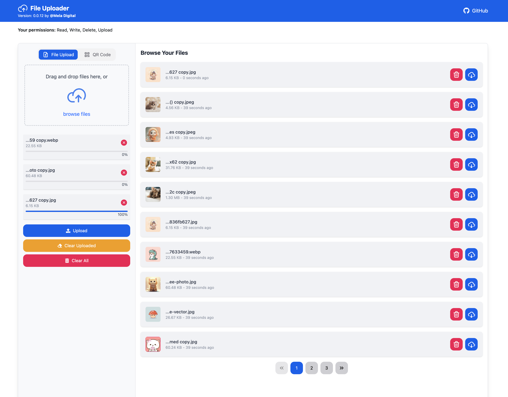

# File Uploader

This is an internal web application that allows users on the same LAN to upload, manage, and share files easily. It provides a simple, intuitive interface to upload various file types (documents, images, videos…), with access control to keep data secure. Because it runs on a local network, file transfers are fast and stable without relying on the Internet.

This is an **internal-use** product. It can integrate with other storage solutions such as Google File Store, S3, etc.
If you need the original source code, please contact **meladigital.team@gmail.com**.

## 🚀 Getting Started

Follow these steps to set up and run the project locally:

### 1. Clone the Repository

```bash
git clone git@github.com:Mela-Digital/file-uploader.git
cd file-uploader
```

### 2. Start the Server

Ensure you have `pnpm` installed, then run:

```bash
pnpm run server
```

The app will be available at [http://localhost:3000](http://localhost:3000).

### 3. Upgrade Dependencies

To upgrade all dependencies to their latest versions, run:

```bash
pnpm run upgrade
```

This ensures that you are using the most up-to-date versions of the packages.

## 🛠️ Tech Stack

- [Next.js ➤](https://nextjs.org/) - React framework for production.
- [pnpm ➤](https://pnpm.io/) - Fast, disk-efficient package manager.

## Custom upload folder

Create a .env file in the root directory. For example:

```env
UPLOADED_FOLDER=_uploads
```

## 🤝 Contributing

Contributions are welcome! To contribute:

1. Fork the repository.
2. Create a new branch for your feature or bugfix.
3. Commit your changes and open a pull request.

For major changes, please open an issue first to discuss what you would like to change.

## Screenshot

</img>
